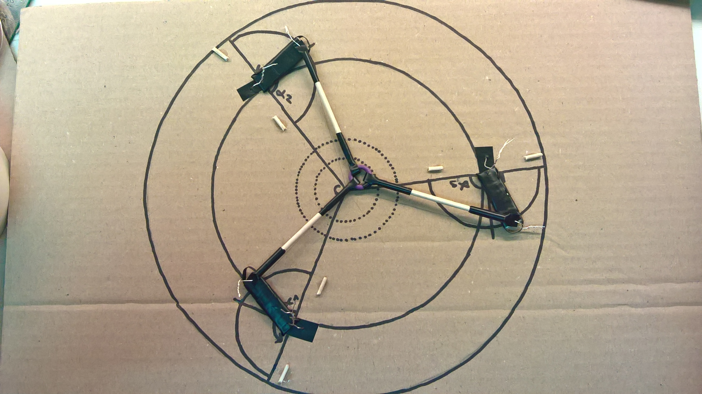
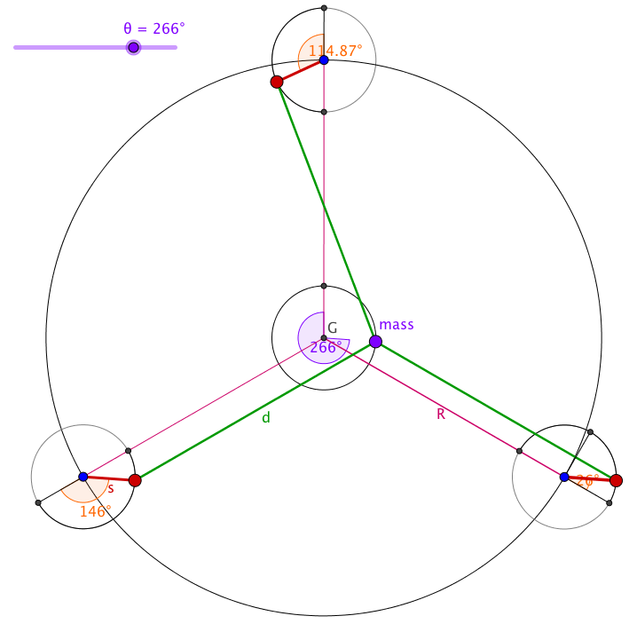
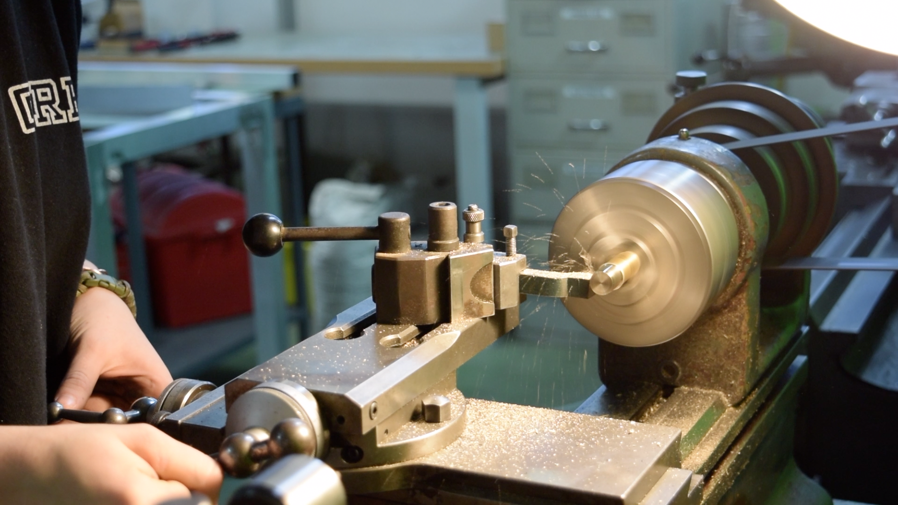
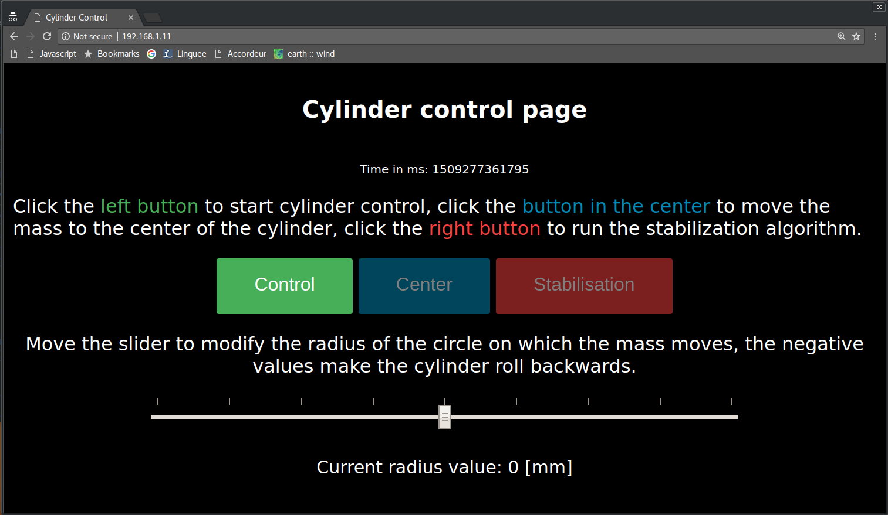

# Remote Control Cylinder

---

Most importantly, this README is not the main source of information for this project. A detailled paper can be found on https://github.com/opatiny/rc2/blob/master/documentation/RemoteControlCylinder.pdf.

  

_Final cylinder prototype_

## Abstract
This one year project consists in the development of a remote controlled cylinder that uses servo motors to displace its center of mass, which leads the cylinder to accelerate linearly. This implies that very diversified fields such as mathematics, physics, programming, electronics and mechanics had to be explored and partly understood to be combined in the final prototype. This prototype has an acrylic glass base structure with a diameter of 32 cm, it is controlled using a C.H.I.P. Pro (a micro-controller similar to Raspberry Pi) and a customized dedicated extension board. The board includes a driver for four servo motors and a 6 axis accelerometer. Finally, the power supply consists of a pack of three AA batteries. All the programming was made using JavaScript scripts that are run using Node.js and a Shell. In addition, the cylinder is remotely controlled through a web page, which make it easy and intuitive for the user. The final features of this robotic cylinder are the following: it can roll forwards and backwards, stop and keep itself balanced on a gentle slope . Also, it is only working well on flat, hard surfaces, though it could easily be adapted to rougher surfaces. The possibility has also been considered of creating a sphere that uses the same technologies as the cylinder that was constructed in this project. Finally, this work is meant to be as open-source as possible. Therefore, the software that was developed is under MIT licence, whereas the hardware is under CERN OHL. The results of the project can be seen easily on: https://youtu.be/QggOjoGjJhA.

## Concept

Initially the project was inspired by a rover realized by [Octanis](https://www.octanis.org/), a student's association specialized in electronics. The rover was supposed to be send to Antarctica and be able to analyse it's environment autonomously. Seeing the Rover tested on a Glacier on a windy day made me wonder what would be the best design for a windproof robot and I immediately thought of a spherical robot. However, once I got back home and looked for similar ideas, I realized that they were already existing projects that consisted in a spherical robot. One of the most famous being the [Sphero](https://www.sphero.com/), a spherical robot toy.

Looking further, I also realized that most of the projects use a similar approach to move the sphere: I call it the hamster wheel approach. It basically is a little car which wheels lay on the outer, rigid shell that induces the movement. I, on the contrary, had imagined a completely different system: I would displace the center of mass of the cylinder to make it roll.

# Programming

All the code that allows the control of the cylinder is contained in the following repository:
https://github.com/opatiny/chip.

The programming has been done in JavaScript (using Node.js) and HTML for the web page that allows the control of the cylinder. Websocket was used to make the web page dynamic.

## Documentation

You might find a lot more of documentation about this project can be found in the [documentation](https://github.com/opatiny/rc2/tree/master/documentation) section of this repository. There, you will find pictures, a developed abstract, and the paper about this project.

## Videos

Cardboard model of the cylinder's mechanism: https://youtu.be/4SuPhpwOK5g

The mass of cylinderPrototype2 moving on a circle using an atMega32u4: https://youtu.be/1zOCNZ_r5pY

Last cylinder's prototype presentation video:
https://youtu.be/QggOjoGjJhA

## Pictures

Here are a few pictures of the project.

_Cardboard model of the cylinder_

_First prototype of the cylinder_

_Geogebra model allowing to see the movement of the servo motors_

_Close-up of the second prototype_

_Metal turning a part of cp3_

_PCB extension allowing the connection of two I2C peripherals to the C.H.I.P. Pro (accelerometer and servo driver)_

_Long aperture picture of the mass moving on a spiral (cp3), max radius is 40mm_

_Final control web page_
